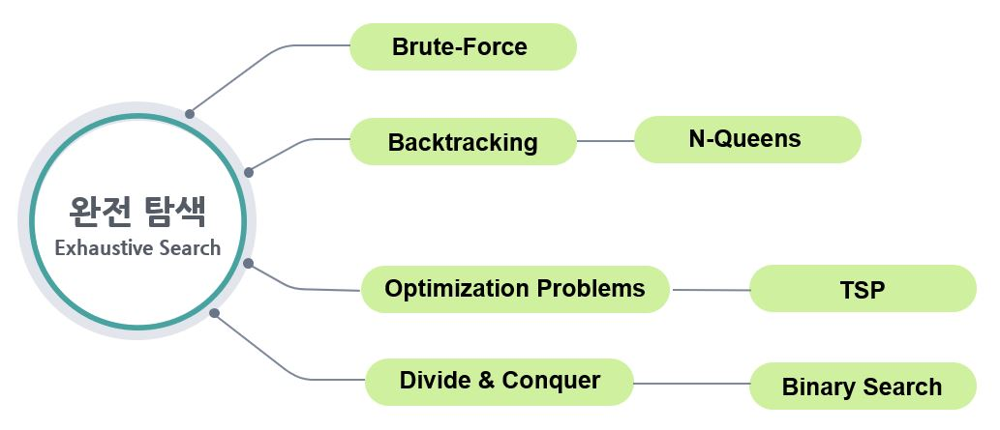

# 백트래킹 알고리즘

---

### 백트래킹 알고리즘이란?

---

- 완전탐색의 아이디어에서 불필요한 분기(Branch) 를 가지치기(Pruning) 하는 것
- 정답을 도출하기 전 탐색과정 중에 정답이 될 수 없는 조건에 해당된다면 가지치기하여 효율을 높일 수 있다.
- 복수의 해를 구할 수 있습니다.

### 상태공간트리란?

- 해를 찾기 위해 탐색할 필요가 있는 모든 후보들을 포함하는 트리입니다.
  트리의 모든 노드들을 방문하면 해를 찾을 수 있습니다.
  루트에서 출발하여 체계적으로 모든 노드를 방문하는 절차를 기술합니다.
